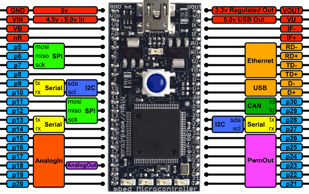

# Mbed LPC1768

This is a simple blinky project using LED-4 on the [Mbed LPC1768](https://os.mbed.com/platforms/mbed-LPC1768/) board.
It is based on the [CMSIS Solution format](https://open-cmsis-pack.github.io/cmsis-toolbox/YML-Input-Format/).

## Debugging

- Keil Studio: Settings - Debug - Connection Mode:haltOnConnect, Settings - Run - Use Daplink (enabled)

> [!NOTE]
> This was tested with the
> [latest CMSIS-DAP firmware (beta)](https://forums.mbed.com/t/new-beta-firmware-for-lpc1768/18917).